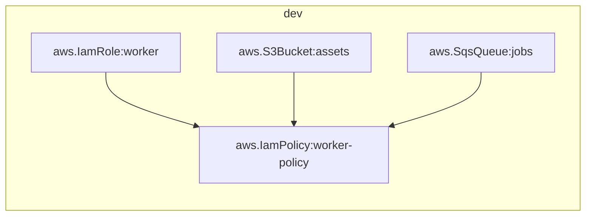
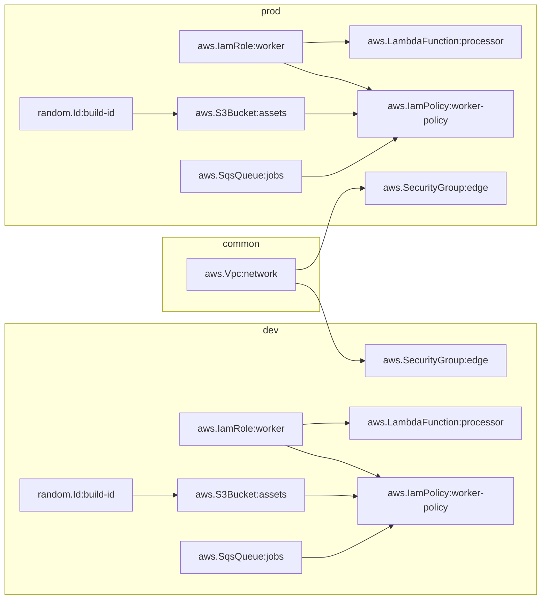

# Building on AWS

This guide builds a multi-environment AWS stack one resource at a time and
introduces each authoring feature where it is first needed.

The finished configuration has a shared VPC in a `common` stack, plus `dev` and
`prod` stacks. Each environment stack holds an S3 bucket, an SQS queue, an IAM
role with an inline policy, a Lambda function that reads a secret, and a security
group attached to the shared VPC: fifteen resources across two providers, wired
together by references.

The end state is
[`examples/aws/example-one.py`](https://github.com/atlantide-org/atlantide/blob/main/examples/aws/example-one.py);
you can compare your file against it at any point.

!!! note "About the output in this guide"
    Every `validate`, `plan` and `graph` block below is output captured by
    running the configuration at that step. These commands belong to the pure
    half of the pipeline and require **no AWS credentials**, so you can follow
    the guide without an AWS account and without creating anything.

    `apply` output is not shown, because producing it provisions real
    infrastructure. Where an applied value would appear, the plan prints
    `(known after apply)`.

This guide assumes the [walkthrough](../how-it-works/walkthrough.md), which
covers the same pipeline against local files in more depth.

---

## Before you start

```bash
mkdir aws-demo && cd aws-demo
```

`plan` requires nothing further. `apply` requires AWS credentials (environment
variables, `~/.aws/credentials`, or an instance role) with permission to create
the resource types used below.

---

## 1. One bucket, one stack

`infra.py`:

```python
from atlantide.core import Stack, output
from atlantide.providers.aws import Region, S3Bucket

with Stack("dev", region=Region.EuNorth1, name_prefix="atlantide", tags={"env": "dev"}):
    assets = S3Bucket("assets", bucket="atlantide-assets-dev-7f3a91c2")
    output("assets_arn", assets.arn)
```

```bash
atlantide validate infra.py
```

```
ok infra.py — 1 resource(s), no cycles
```

```bash
atlantide plan infra.py --state infra.db
```

```
state: infra.db
dev ────────────────────────────────────────────────────────────────────────────
  + create  aws.S3Bucket:assets

Plan: 1 to add

Outputs:
  dev:assets_arn = (known after apply)
```

| | |
|---|---|
| `Stack("dev", ...)` | A namespace. Every resource inside gets node id `dev:<type>:<name>` and inherits the stack's `region`, `name_prefix` and `tags`. The same logical name can exist in every stack without colliding. |
| `Region.EuNorth1` | An enum, so a typo is a type error in your editor instead of an API error at apply time. |
| `output(...)` | Declared inside the `with` block, so it is namespaced `dev:assets_arn` and readable by another stack. Declared outside, it lands in `default`. |

`S3Bucket` blocks public access and enables SSE-S3 encryption by default. A
public or unencrypted bucket must be configured explicitly.

---

## 2. A queue, a role, and a policy wired by references

Add an SQS queue, an IAM role, and an inline policy that grants the role access
to the bucket and the queue:

```python
from atlantide.core import Stack, output
from atlantide.providers.aws import (
    IamPolicy, IamRole, Region, S3Bucket, ServicePrincipal, SqsQueue, allow,
)

with Stack("dev", region=Region.EuNorth1, name_prefix="atlantide", tags={"env": "dev"}):
    assets = S3Bucket("assets", bucket="atlantide-assets-dev-7f3a91c2")
    jobs = SqsQueue("jobs", fifo=True)

    worker = IamRole("worker", assumed_by=[ServicePrincipal.Ec2, ServicePrincipal.Lambda])
    IamPolicy(
        "worker-policy",
        role_arn=worker.arn,
        policy_name="worker-access",
        statements=[
            allow(S3Bucket.Action.GetObject, S3Bucket.Action.PutObject, on=assets.objects_arn),
            allow(SqsQueue.Action.SendMessage, on=jobs.arn),
        ],
    )
    output("assets_arn", assets.arn)
```

```bash
atlantide plan infra.py --state infra.db
```

```
state: infra.db
dev ────────────────────────────────────────────────────────────────────────────
  + create  aws.IamPolicy:worker-policy
  + create  aws.IamRole:worker
  + create  aws.S3Bucket:assets
  + create  aws.SqsQueue:jobs

Plan: 4 to add
```

The config declares no ordering, but the engine derives one:

```bash
atlantide graph infra.py --format mermaid
```



The policy reads `worker.arn`, `assets.objects_arn` and `jobs.arn`. None of
those ARNs exists yet, so each read returns a lazy `Ref`, and each `Ref` becomes
a graph edge. The role, bucket and queue are independent and are created in
parallel; the policy waits for all three.

`allow()` builds the policy document, so no JSON is hand-written. Actions are
enum members such as `S3Bucket.Action.GetObject`, so a misspelled action fails
before anything runs.

The statement uses `assets.objects_arn` rather than `assets.arn`, because
object-level permissions require the `/*` form. The resource exposes both ARNs as
named attributes.

---

## 3. A Lambda, fingerprinted from disk

Create the handler:

```python title="processor/app.py"
def handler(event, context):
    return {"received": len(event.get("Records", []))}
```

Add the function and give it the role:

```python
processor = LambdaFunction(
    "processor",
    role_arn=worker.arn,
    handler="app.handler",
    code_path="processor",
    signing_secret=SecretRef("app/signing-key-dev"),
)
```

`code_path` points at a local directory. At config-evaluation time the directory
is zipped with sorted entries and fixed timestamps, then fingerprinted into
`code_sha256`. Two checkouts of the same source produce the same digest; editing
`app.py` changes it, and the next plan shows an update.

Plan:

```bash
atlantide plan infra.py --state infra.db
```

```
state: infra.db
error: undefined secret(s): dev:aws.LambdaFunction:processor.signing_secret -> 
'app/signing-key-dev'
```

`SecretRef("app/signing-key-dev")` names a secret that is not in the store. An
apply would fail part-way through, after creating some resources, so Atlantide
checks every referenced secret during planning.

Set the secret:

```bash
atlantide secret set app/signing-key-dev
```

```
set secret 'app/signing-key-dev'
```

Without a value argument, the command prompts for it with hidden input. By
default, secrets are held in a local AES-256-GCM encrypted keyfile store;
`[secrets]` in `atlantide.toml` can point at SSM Parameter Store or the
environment instead.

```bash
atlantide plan infra.py --state infra.db
```

```
state: infra.db
dev ────────────────────────────────────────────────────────────────────────────
  + create  aws.IamPolicy:worker-policy
  + create  aws.IamRole:worker
  + create  aws.LambdaFunction:processor
  + create  aws.S3Bucket:assets
  + create  aws.SqsQueue:jobs

Plan: 5 to add
```

The secret's value never appears in the config, the IR or the state file; only
its name does. The plaintext is resolved in memory at apply time. State keeps a
salted digest, which detects a rotated secret without storing the value.

---

## 4. A shared VPC, and a second environment

Put the VPC that both environments share in its own stack:

```python
with Stack("common", region=Region.EuNorth1, name_prefix="atlantide", tags={"env": "common"}):
    network = Vpc("network", cidr_block="10.0.0.0/16")
    vpc_id = output("vpc_id", network.vpc_id)
```

`output()` returns a typed handle. When you consume the variable instead of a
string such as `"common:vpc_id"`, a typo is an undefined-variable error at config
time instead of a mismatch found during planning.

Declare the two environments and what differs between them:

```python
from atlantide.core import Config, EnvSchema

class AppEnv(EnvSchema):
    versioning: bool = False

config = Config(
    AppEnv,
    envs={
        "dev": {
            "region": Region.EuNorth1,
            "name_prefix": "atlantide",
            "tags": {"env": "dev"},
        },
        "prod": {
            "region": Region.EuNorth1,
            "name_prefix": "atlantide",
            "tags": {"env": "prod"},
            "versioning": True,
        },
    },
)
```

Wrap the environment body in a loop over the environments, and attach a security
group to the shared VPC:

```python
for env in config.envs():
    with Stack(env.name, config=env):
        ...
        edge = SecurityGroup("edge", group_name=f"edge-{env.name}", vpc_id=vpc_id)
```

`region`, `name_prefix` and `tags` are well-known keys of every environment, so
`config=env` supplies all three. `versioning` is a config-specific variable with
a default: `dev` uses the default and `prod` overrides it. The shape is an
`EnvSchema`, the one class Atlas-lang admits (annotated fields only), so your
editor completes `env.versioning` and a misspelling is a type error instead of a
plan-time error.

The `Config` is validated when it is constructed, so a missing or mistyped prod
value fails `atlantide validate` in CI instead of when prod is applied.

Because `common` is in the same config, the engine turns the output handle into
a dependency edge and applies `common` before `dev` and `prod`. `dev` and `prod`
are independent and apply in parallel. `common` sits *outside* the loop because
it is not per-environment, so narrowing a run to one environment keeps it in the
graph.

!!! tip "Running one environment"
    `atlantide plan --env prod` acts on `prod` alone. `dev` is out of scope, not
    undeclared: its recorded state is not diffed and is never planned for
    deletion. The plan reports this:

    ```
    envs: prod (of dev, prod) — dev is not planned and will not change
    ```

!!! note "Two stacks, or two configs?"
    A stack applied by a *separate* config is referenced with
    `StackReference("common").output("vpc_id")`, which resolves from committed
    state instead of from an edge within the run. Use the handle when the stacks
    share a config, and `StackReference` when they do not.

---

## 5. Deterministic names, and a value decided at apply

Two more lines in the environment body:

```python
build = Id("build-id", byte_length=4)

bucket_name = f"atlantide-assets-{env.name}-{uuid5('atlantide-buckets', env.name)[:8]}"
assets = S3Bucket(
    "assets",
    bucket=bucket_name,
    versioning=env.versioning,
    tags={"build_id": build.result, "config_hash": sha256_hex(env.name)[:12]},
)
```

The two values are decided at different times:

| | When it is decided | Where it lives |
|---|---|---|
| `uuid5(...)`, `sha256_hex(...)` | **Config time.** Atlas-lang builtins — pure functions the interpreter injects, used with no import. | A fixed literal baked into the IR. |
| `random.Id` | **Apply time.** A *resource*, from the `random` provider. Generated once and pinned in state. | State. A re-apply is a NOOP, never a new value. |

The bucket name is stable across every run and machine; the build id is stable
across every run after the first.

The bucket reads `build.result`, so the engine orders the `random` resource
before the AWS bucket in a single graph spanning two providers.

`versioning=env.versioning` reads the value from the environment instead of
branching on its name. Per-environment differences are declared once, typed, in
the `Config`, instead of as `env == "prod"` tests in the body.

---

## 6. Policies, at the top of the file

```python
enforce("require-tags", keys=["env"])
enforce("deny-destroy-in-protected", stacks=["prod"])
```

Policies run at the end of planning against the finished changeset, so they see
the planned actions as well as the config. A mandatory violation blocks `apply`
before anything is changed.

To trigger the first policy, remove the `env` tag from the stacks and plan:

```
policy DENY require-tags: dev:aws.S3Bucket:assets is missing tag(s): env
policy DENY require-tags: dev:aws.SqsQueue:jobs is missing tag(s): env
policy DENY require-tags: dev:aws.SecurityGroup:edge is missing tag(s): env
policy DENY require-tags: dev:aws.LambdaFunction:processor is missing tag(s): 
env
...
10 mandatory policy violation(s) block apply
```

Every offending resource is named. Stack tags merge into every resource in the
body, so restoring `tags={"env": env}` on the two stacks resolves all ten
violations.

The second policy, `deny-destroy-in-protected`, fails any plan that deletes or
replaces something in `prod`. This includes removing a resource from the file
and editing an `immutable()` field, since a replacement is a destroy followed by
a create.

!!! warning "It does not cover `atlantide destroy`"
    `destroy` runs against an empty config and therefore evaluates no policy
    bindings. `Lifecycle(prevent_destroy=True)` is the per-resource guard for
    that path.

---

## 7. The finished config

Add the exports for each environment:

```python
output("assets_arn", assets.arn)
output("assets_bucket", assets.bucket)
output("jobs_url", jobs.url)
output("worker_role_arn", worker.arn)
output("processor_arn", processor.arn)
output("build_id", build.result)
output("edge_sg_id", edge.group_id)
output("region", Region.EuNorth1)
```

```bash
atlantide plan infra.py --state infra.db
```

```
state: infra.db
common ─────────────────────────────────────────────────────────────────────────
  + create  aws.Vpc:network
dev ────────────────────────────────────────────────────────────────────────────
  + create  aws.IamPolicy:worker-policy
  + create  aws.IamRole:worker
  + create  aws.LambdaFunction:processor
  + create  aws.S3Bucket:assets
  + create  aws.SecurityGroup:edge
  + create  aws.SqsQueue:jobs
  + create  random.Id:build-id
prod ───────────────────────────────────────────────────────────────────────────
  + create  aws.IamPolicy:worker-policy
  + create  aws.IamRole:worker
  + create  aws.LambdaFunction:processor
  + create  aws.S3Bucket:assets
  + create  aws.SecurityGroup:edge
  + create  aws.SqsQueue:jobs
  + create  random.Id:build-id

Plan: 15 to add

Outputs:
  common:vpc_id = (known after apply)
  dev:assets_arn = (known after apply)
  dev:assets_bucket = 'atlantide-assets-dev-b89f6cc5'
  dev:jobs_url = (known after apply)
  dev:worker_role_arn = (known after apply)
  dev:processor_arn = (known after apply)
  dev:build_id = (known after apply)
  dev:edge_sg_id = (known after apply)
  dev:region = 'eu-north-1'
  prod:assets_arn = (known after apply)
  prod:assets_bucket = 'atlantide-assets-prod-445ca963'
  ...
```

`assets_bucket` and `region` already have values because both are computed at
config time. The other outputs read `(known after apply)`.

The full graph:



One VPC feeds two independent environment subgraphs. The ordering follows from
which resources read which values.

---

## 8. Apply, and what happens after

```bash
atlantide secret set app/signing-key-prod    # prod needs its own
atlantide apply infra.py --state infra.db
```

Apply takes a lease over the reachable graph, re-diffs under that lock, and
reconciles independent nodes in parallel. State is written per node as each one
succeeds, so a crash part-way through leaves an accurate record. On failure, the
default `--on-failure rollback` undoes the completed nodes.

A second run makes every node a no-op with no AWS API calls: the engine compares
hashes and stops.

After applying:

```bash
atlantide output --state infra.db        # what the apply exported
atlantide state list --state infra.db    # what is recorded
atlantide refresh --state infra.db       # has anything drifted?
atlantide destroy --state infra.db       # tear it down, dependents first
```

---

## Making it a project

Put the defaults in an `atlantide.toml` beside the config to omit the flags:

```toml
config      = "infra.py"
state       = "infra.db"
aws_region  = "eu-north-1"
aws_profile = "default"
```

```bash
atlantide plan       # no flags needed
```

For a team, move state to a shared backend (S3 with DynamoDB locking, or
Postgres) so concurrent runs cannot overwrite each other. See
[Remote state](../reference/remote-state.md).

A `[profile.<name>]` overlay is separate from the `Config`: the `Config` defines
what each environment contains, and a profile defines where a run points (state
backend, AWS account, parallelism). They are selected independently with `--env`
and `--profile`. See [Configuration](../reference/configuration.md).

---

## Where to go next

- **[The Merkle hash](../how-it-works/merkle.md)**: why the second apply makes
  no API calls, and which nodes a change propagates to.
- **[Authoring](../reference/authoring.md)**: output combinators for values not
  known until apply, explicit ordering, and renaming a resource without
  destroying it.
- **[Components](../reference/components.md)**: packaging this stack as a
  reusable construct, publishable from a git repository and pinned by commit.
- **[Providers](../reference/providers.md)**: the full AWS resource list, and
  how to write a provider.
- **A static website**:
  [`examples/aws/example-three.py`](https://github.com/atlantide-org/atlantide/blob/main/examples/aws/example-three.py)
  builds a private S3 origin behind CloudFront with an Origin Access Control, in
  four resources.
