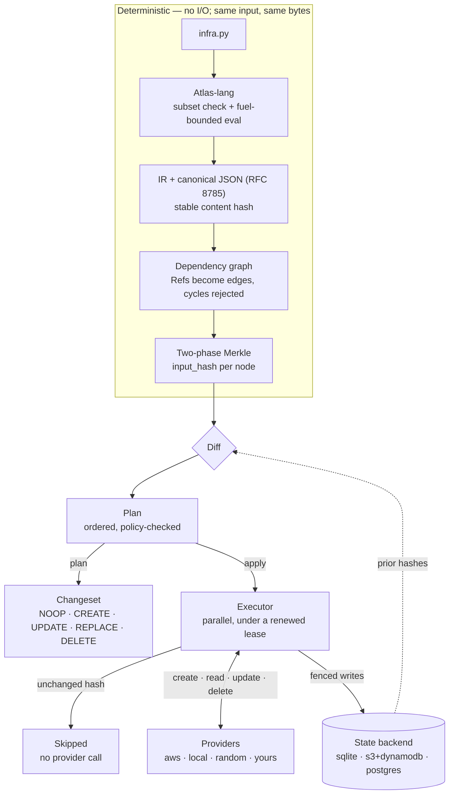

# Atlantide

**Typed, deterministic Infrastructure-as-Code for Python.**
{: .hero-tagline }

Infrastructure is written in Python and checked by your IDE and `mypy`. The same
config always produces the same plan, and the engine verifies this.

=== "uv"

    ```bash
    uv tool install atlantide
    ```

=== "pipx"

    ```bash
    pipx install atlantide
    ```

=== "pip"

    ```bash
    pip install atlantide
    ```

=== "Binary (no Python)"

    ```bash
    # Linux x86-64; macOS and Windows builds are on the Installation page
    curl -L -o atlantide \
      https://github.com/atlantide-org/atlantide/releases/latest/download/atlantide-linux-x86_64
    chmod +x atlantide && sudo mv atlantide /usr/local/bin/
    ```

The package requires Python 3.12 or newer. The standalone binary bundles its own
runtime but cannot load third-party provider plugins. See
[Installation](install.md) to choose between them.

!!! tip "Using a coding agent?"
    Point it at [`llms.txt`](https://atlantide-org.github.io/llms.txt), or add
    the [agent guide](agents.md) to your project so it writes valid Atlas-lang
    and knows which commands are safe to run.

## Quickstart

`atlantide init` scaffolds a working project. The default `minimal` template uses
the `local` provider and needs no cloud credentials:

```bash
mkdir demo && cd demo
atlantide init
```

```
created  demo/.gitignore
created  demo/atlantide.toml
created  demo/infra.py
ok infra.py — 1 resource(s), no cycles

next:  atlantide plan
```

```bash
atlantide apply -y     # create it
atlantide plan         # again: unchanged
```

```
  + create  local.File:greeting
Plan: 1 to add
...
Applied: 1 to add  (0.0s)
```
```
  = noop    local.File:greeting
Plan: 1 unchanged
```

The second `plan` compares recorded hashes with freshly computed ones and calls
no provider. `atlantide init --template aws` scaffolds the same project for AWS.

## A quick look

```python
from atlantide.core import Config, EnvSchema, Stack, output
from atlantide.policy import enforce
from atlantide.providers.aws import S3Bucket, SqsQueue

enforce("require-tags", keys=["env"])
enforce("deny-destroy-in-protected", stacks=["prod"])

class AppEnv(EnvSchema):
    versioning: bool = False

config = Config(
    AppEnv,
    envs={
        "dev":  {"region": "eu-north-1", "tags": {"env": "dev"}},
        "prod": {"region": "eu-north-1", "tags": {"env": "prod"}, "versioning": True},
    },
)

for env in config.envs():                       # env: AppEnv
    with Stack(env.name, config=env, name_prefix="atlantide"):
        assets = S3Bucket("assets", versioning=env.versioning)
        jobs = SqsQueue("jobs", fifo=True)
        output("assets_arn", assets.arn)
```

```bash
atlantide plan  infra.py               # preview, every environment
atlantide apply infra.py               # reconcile, in parallel
atlantide apply infra.py               # again: all NOOP, zero provider calls
atlantide apply infra.py --env prod    # prod only; dev is not diffed or touched
```

One [`Config`](reference/configuration.md#environments) holds every environment
and what differs between them. Each variable declares a type and an optional
default, so a missing or mistyped prod value fails `atlantide validate`, not the
prod apply. `Stack` reads the well-known keys `region`, `tags` and `name_prefix`
directly. Declaring the shape as an `EnvSchema` makes `env.versioning` complete in
an editor and makes `env.versionning` a type error.

Reading another resource's output, such as `assets.arn`, returns a lazy `Ref`.
The read creates the dependency edge, so no `depends_on` declarations or string
addresses are needed. The `Ref` resolves to the real value at apply time.

## Three ideas

**Enforced determinism.** Configs are Python, executed by *Atlas-lang*: a
bounded interpreter with no clock, randomness, environment or network. Two runs of
the same config produce a byte-identical intermediate representation and the same
content hash. The interpreter enforces this; it does not rely on author
convention.

**Graph state with Merkle skip.** Resources form a dependency graph, and each node
carries a hash of its own inputs combined with its dependencies' hashes. Apply
skips any node whose hash is unchanged without calling a provider, and reconciles
independent nodes in parallel.

**Per-field mutability.** Every field is declared `mutable()`, `immutable()` or
`computed()`. A mutable change is an in-place update, an immutable change is a
replacement, and computed fields never contribute to a diff. The cost of a change
is visible in the type before anything runs.

## The pipeline

Every `plan` and `apply` runs one pipeline. Everything before the diff is pure and
deterministic; everything after it performs I/O.



Because the first half performs no I/O, `plan` needs no credentials, `validate`
can run in a pre-commit hook, and one compiled artifact can be promoted from
staging to production without re-executing the config.

## Where to start

<div class="grid cards" markdown>

-   :material-download:{ .lg .middle } **[Installation](install.md)**

    ---

    The standalone binary or the PyPI package, and how to choose.

-   :material-swap-horizontal:{ .lg .middle } **[Coming from Terraform](comparison.md)**

    ---

    The vocabulary mapping, key differences, and current limitations.

-   :material-cog-play:{ .lg .middle } **[How it works](how-it-works/index.md)**

    ---

    The mental model, then a hands-on walkthrough that needs no AWS account.

-   :material-aws:{ .lg .middle } **[Building on AWS](aws/index.md)**

    ---

    A multi-environment stack one resource at a time: VPC, S3, SQS, IAM,
    Lambda, secrets and policies.

-   :material-console:{ .lg .middle } **[CLI](reference/cli.md)**

    ---

    Every command, targeting, `--env`, exit codes.

-   :material-robot-outline:{ .lg .middle } **[For agents](agents.md)**

    ---

    `llms.txt`, Markdown for every page, and a skill for coding agents.

</div>

**Reference:**
[Authoring](reference/authoring.md) ·
[Configuration](reference/configuration.md) ·
[Policies](reference/policies.md) ·
[Remote state](reference/remote-state.md) ·
[Providers](reference/providers.md) ·
[Components](reference/components.md) ·
[CI and automation](reference/ci.md) ·
[Troubleshooting](reference/troubleshooting.md) ·
[Glossary](glossary.md)

Source: [github.com/atlantide-org/atlantide](https://github.com/atlantide-org/atlantide)
